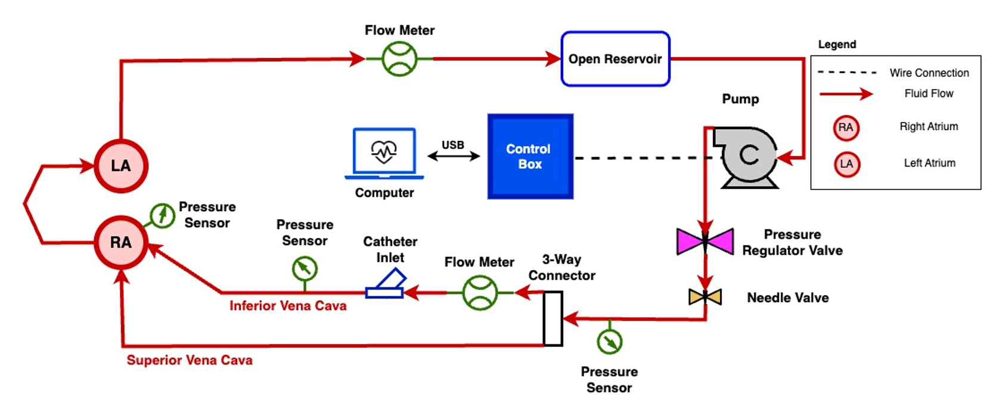
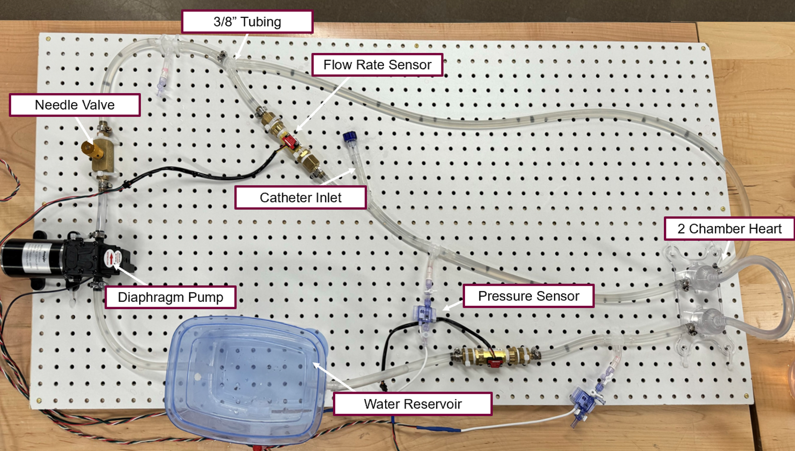
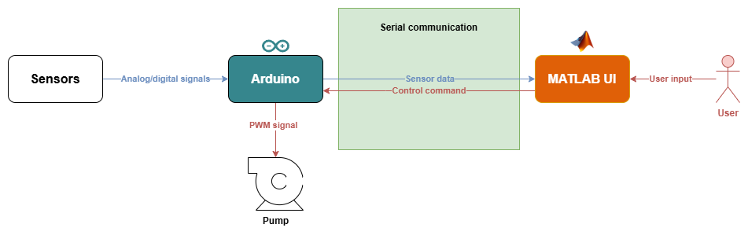

# Cardiac Catheterization Testing System (CCTA)

## Overview

<em>Figure 1: System schematic showing data and control flow between components.</em>

<em>Figure 2: Physical prototype of the Cardiac Catheterization Testing Apparatus (CCTA).</em>

This project presents a low-cost, modular cardiac catheterization testing system designed to simulate physiological pressure and flow conditions in a controlled and reproducible in-vitro environment. It replaces the need for expensive commercial simulators or ethically problematic animal testing setups by offering a customizable, software-integrated alternative.

At the core of this system is a MATLAB UI that interfaces with an Arduino microcontroller. The Arduino collects data from pressure and flow sensors and transmits it to MATLAB, where it's processed and visualized in real-time. Based on user-defined targets and modes, MATLAB sends control signals back to the Arduino to adjust a positive displacement pump. The system supports manual, automatic (PID-based), and pulsatile flow control.

---

## Folder Structure

### `/data`
By default this folder is not present. When the "Export Data" button is pressed it will be generated if needed. It is used to store collected experimental data, logs, and exported results from MATLAB sessions.

### `/docs`
Project documentation, including:
- `CCTA Full System Report.docx`
  - Report outlining system design, components, verification tests, and future work
- `CCTA Operation Manual.docx`
  - Short operation manual for new users
- `CCTA Verification Results/`
  - Folder containing a list of test procedures and results that were performed on the system before handoff to Boston Scientific
- `CCTA BOM.xlsx`
  - Full bill of materials

### `/src`
Includes the complete codebase:
- **MATLAB App**: Provides the user interface for data visualization, system control, and parameter configuration. Handles serial communication, real-time plotting, setpoint tracking, and exporting functions.
- **Arduino Code**: Acquires sensor data and transmits it to MATLAB via serial. It interprets control signals to adjust pump output depending on the selected mode:
  - **Manual Mode**: Receives and applies a direct PWM value
  - **Auto Mode**: Uses PID control based on provided setpoint and coefficients
  - **Pulsatile Mode**: Generates a sinusoidal PWM signal based on amplitude and BPM settings

See the diagram below for a simplified system data flow:

---

## For Developers

This system consists of two main codebases: one running on the Arduino, and one built in MATLAB using App Designer. The two communicate through serial to perform real-time data acquisition and control.

### Additional Documentation

- Arduino documentation is available [here](https://docs.arduino.cc/)
- MATLAB App Designer documentation is available [here](https://www.mathworks.com/help/matlab/app-designer.html)

### Code Responsibilities

- **Arduino**:
  - Reads pressure and flow sensors using analog inputs
  - Controls the pump using PWM output
  - Runs PID control in **Auto Mode**, sinusoidal wave generation in **Pulsatile Mode**, and sets direct power in **Manual Mode**
  - Sends structured data strings to MATLAB over serial
  - Listens for incoming commands from MATLAB (e.g., new setpoints, PID parameters)

- **MATLAB (App Designer)**:
  - Acts as the central hub for user interaction
  - Parses serial data from Arduino for visualization and logging
  - Sends control commands back to Arduino depending on user selections (mode, setpoints, PID values)
  - Provides UI-based manual control, automatic control (with real-time PID tuning), and pulsatile flow configuration
  - Handles data export, logging, and static head offset calibration

### Code Flow

#### Arduino

- `loop()`
  - The main function: reads sensors, updates control signals, sends data back to MATLAB.
  - Determines which control mode to run (Manual, Auto, Pulsatile) based on the last received command.

- `serialEvent()` and `processSerial()`
  - Run outside the main loop.
  - Triggered when data is received from MATLAB.
  - Parses incoming messages (e.g., mode change, new setpoints, PID config).

#### MATLAB

- `ConnectDisconnectButtonPushed()`
  - Entry point for establishing communication.
  - Starts the core loop via `app.runMainLoop()` which:
    - Continuously reads from serial
    - Updates plots and status indicators
    - Sends control data back to Arduino as needed

- UI Interactions
  - Each control (e.g., sliders, buttons) has a specific callback
  - You can find them by right-clicking the component in App Designer → "Callback" or searching the code (e.g., `PumpPowerSliderValueChanged`)
  - These callbacks manage user input and trigger control logic accordingly

### Notes on Editing the UI

- The MATLAB App is built using App Designer, and its file (`CCTA.mlapp`) is a binary format that **can only be edited inside MATLAB App Designer**.
- The exported file `CCTA_exported.m` is provided for Git version tracking only. It should be re-exported and committed after any changes to maintain traceability.
- If you plan to expand the app significantly or work collaboratively on the UI, consider moving to a **programmatic UI** approach:
  - [Programmatic App Building](https://www.mathworks.com/help/matlab/develop-apps-programmatically.html)
  - [GUI Layout Toolbox](https://www.mathworks.com/matlabcentral/fileexchange/47982-gui-layout-toolbox)
- This transition is only necessary for large or collaborative UI development. Small tweaks by a single developer can continue using App Designer.

---

## Contributors

For any questions or inquiries, feel free to reach out to the contributors:

- **Dabeer Abdul-Azeez** (Engineering Physics) – dabeerazeez@gmail.com  
- **Syed Saad Ali** (Engineering Physics & BME) - saad.ali1541@gmail.com
- **Yousuf Araim** (Mechanical & BME) - araimy4@gmail.com
- **Owen Johnstone** (Engineering Physics & BME) - owenjohnstone01@icloud.com
- **Aly Pirbay** (Mechanical) - apirbay1@gmail.com
